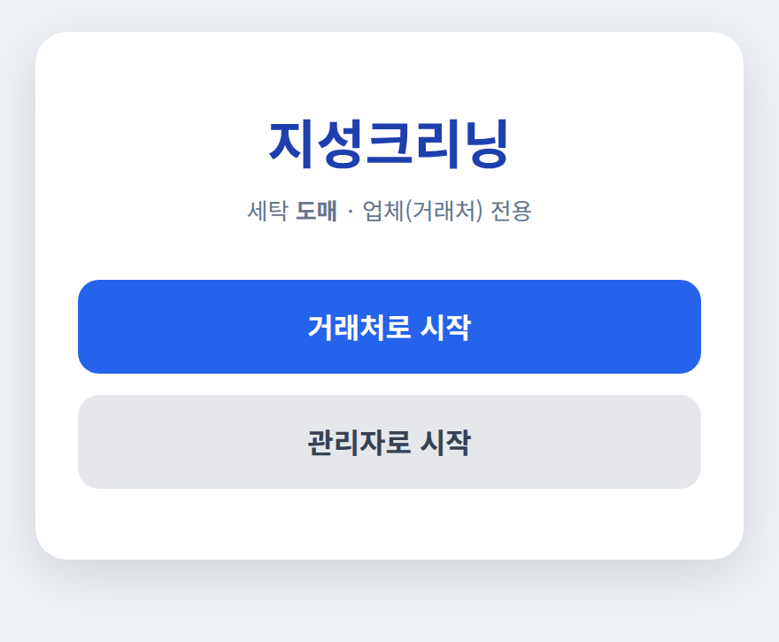
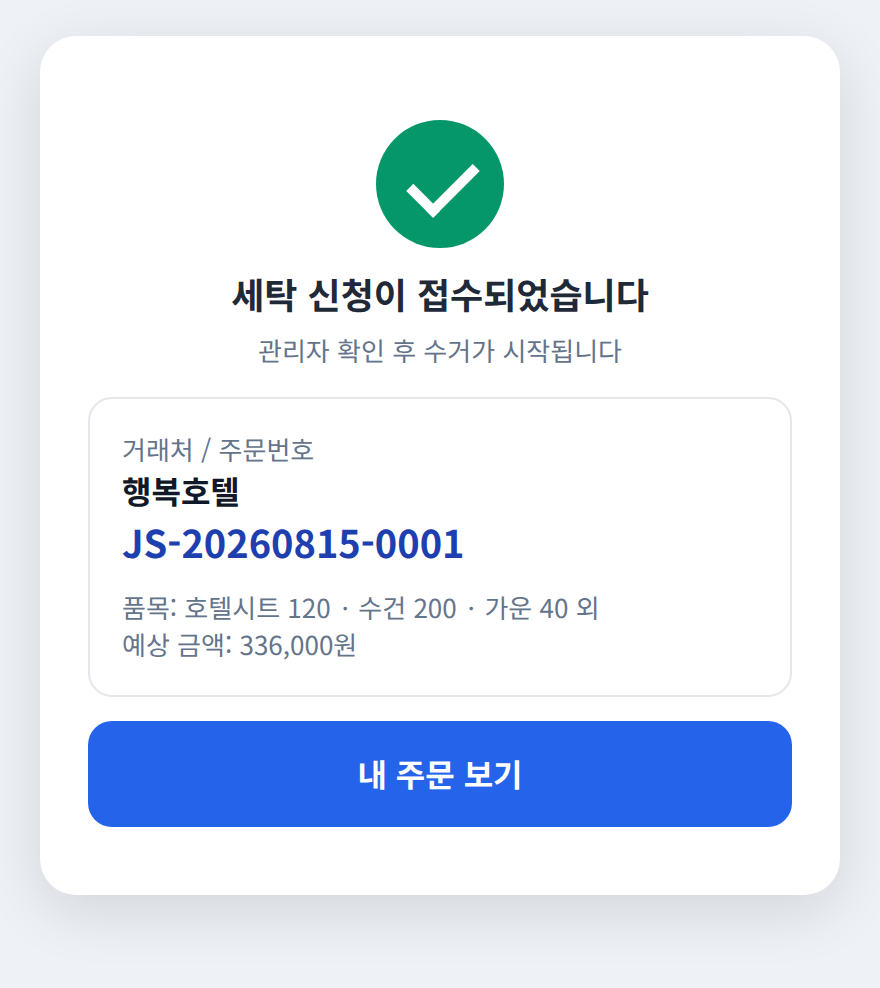
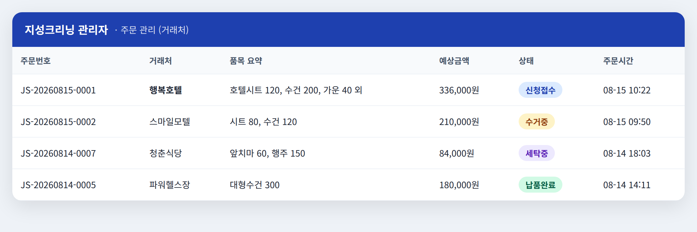

# 지성크리닝 4일 집중 개발 일정 (정효준용)

> 기간: **8/14(목) ~ 8/17(일)** · 마감·시연: **8/18(월)**
> 목표: **핵심 주문흐름 1개가 실제로 돌아가는 데모** 완성
> 스택: **Next.js + SQLite** (명령어 하나로 실행되는 가벼운 구성)
> 실행: `codex --yolo` (완전 자동 모드)

---

## 🎯 4일 뒤 완성될 것 (데모 시나리오)

한 사람이 아래를 **처음부터 끝까지 시연**할 수 있으면 성공입니다.

```text
① 거래처로 로그인 → 업소용 품목 대량 선택(예: 호텔시트 120, 수건 200) → 예상금액 확인 → 주문! → 주문번호 받음
② 관리자로 로그인 → 들어온 주문 목록에서 그 거래처 주문 확인
③ 관리자가 상태를 바꿈:  주문확인 → 수거중 → 수거완료 → 세탁중 → 세탁완료 → 납품완료
④ 다시 거래처 화면 → 주문 상세에서 "납품완료"로 바뀐 걸 확인
```

> ⚑ **우리는 도매(B2B)입니다.** "고객"은 개인이 아니라 **거래처(업체)**이고, 품목은 업소용을 **대량**으로 받습니다.
> 데모의 "고객"은 전부 **거래처(예: 행복호텔)**로 이해하세요. (개인 옷 세탁은 우리 사업이 아닙니다.)

이 **하나의 고리**가 지성크리닝의 심장입니다. 이게 돌면 "동작하는 프로그램"입니다.

> ⚠️ 이 데모에 **없는 것**(일부러 뺌): 진짜 결제·진짜 문자·진짜 휴대폰인증·안드로이드 앱·세탁공장 별도화면·통계.
> 이건 마감 이후 정식 개발에서 붙입니다. 4일 안엔 **핵심 고리 하나**에만 집중합니다.

### 완성 화면 미리보기 (이런 게 만들어집니다)

> 아래는 4일 뒤 완성될 화면의 **예시**입니다. 똑같이 만들 필요는 없고, "이 정도면 성공"의 기준으로 보세요.
> 각 날짜 과제에서 해당 화면이 나오면 그날은 통과입니다.

| 거래처 — 발주 신청 (Day 2) | 관리자 — 상태 변경 (Day 3) | 거래처 — 상태 확인 (Day 4) |
| :---: | :---: | :---: |
|  |  |  |

---

## 📌 매일 지키는 4가지 습관 (매우 중요)

매일, 모든 과제에 아래를 반복하세요. 이게 비개발자가 4일을 버티는 안전장치입니다.

1. **시작 전 저장**: 새 작업 전 Codex에게 → `지금 상태를 git으로 저장해줘`
2. **하나씩**: 한 번에 하나만 시키고, 될 때까지 다음으로 안 감
3. **눈으로 확인**: 만들면 항상 → `실행해서 브라우저에서 보게 해줘`
4. **막히면 복붙**: 에러/이상한 화면은 통째로 복사해 Codex에 붙이고 `이거 고쳐줘`

> 세부 방법은 `codex-사용-교육매뉴얼.md` 참고. 개념이 헷갈리면 `정효준-개발이해-교육가이드.md` 참고.

---

# 📅 Day 1 — 8/14(목) : 환경 세팅 + 첫 화면 띄우기

> 오늘의 목표: **컴퓨터에 도구를 다 깔고, 빈 앱이 브라우저에 뜨는 것까지.**
> 오늘은 코딩이 아니라 "준비"의 날입니다. 여기서 막히는 게 정상이니 조급해하지 마세요.

### 1교시 · 학습 (30분)
- `정효준-개발이해-교육가이드.md`의 **A부(용어)** + **B부(서비스 이해)** 읽기
- `codex-사용-교육매뉴얼.md`의 **0~4장** 읽기

### 2교시 · 도구 설치 (매뉴얼 1~3장 따라하기)
- [ ] Node.js 설치 (`node --version`으로 확인)
- [ ] Git 설치 (`git --version`)
- [ ] VS Code 설치
- [ ] Codex 설치: `npm install -g @openai/codex` → `codex --version`
- [ ] 로그인: `codex login` (ChatGPT 계정)

**✔ 설치가 제대로 됐는지 확인 (터미널에 입력 → 이런 게 나오면 정상):**

```text
> node --version
v22.14.0            ← v22 이상이면 OK

> git --version
git version 2.45.2  ← 숫자가 나오면 OK

> codex --version
codex-cli 0.30.0    ← 숫자가 나오면 OK
```

> 위 숫자는 예시라 조금 달라도 됩니다. **에러 없이 숫자만 나오면 성공**입니다.

**⚠ 자주 나오는 문제 (당황 말고 아래대로):**

| 증상 | 원인 | 해결 |
| --- | --- | --- |
| `'codex'은(는) 인식할 수 없는 명령…` | 설치 후 터미널을 안 껐다 켬 | 터미널 **완전히 닫고 다시 열기** |
| `'node'은(는) 인식할 수 없는…` | Node 설치 안 됨/재시작 안 함 | Node 재설치 후 **컴퓨터 재시작** |
| npm 설치 중 빨간 글자 | 인터넷/권한 문제 | 그 빨간 글자를 복사해 Codex나 검색에 붙여 확인 |
| `codex` 대신 이상한 게 설치됨 | `@openai/`를 빼먹음 | 반드시 `npm install -g @openai/codex` |

### 3교시 · 프로젝트 첫 실행
1. VS Code로 지성크리닝 폴더 열기 → 터미널 열기 (`Terminal → New Terminal`)
2. Codex 시작: `codex --yolo`
3. AGENTS.md 만들기: 대화창에 `/init` 입력 → 생성되면 매뉴얼 5장의 예시 내용을 채워달라고 지시
4. **아래 지시문을 그대로 복붙:**

```
Document/명세서.md 와 Document/개발 설계서.md 를 먼저 읽어줘.
지금부터 지성크리닝 데모를 만들 거야. 스택은 Next.js + SQLite로 해줘.
오늘은 딱 여기까지만: 아무 기능 없는 빈 Next.js 프로젝트를 만들고,
첫 화면에 "지성크리닝" 제목과 "거래처로 시작 / 관리자로 시작" 버튼 2개만 놔줘.
다 되면 서버를 실행하고, 내가 브라우저에서 볼 주소(예: http://localhost:3000)를 알려줘.
모든 설명은 한국어로 해줘.
```

5. Codex가 알려준 주소를 브라우저에 입력 → 화면 확인
6. 저장: `지금 상태를 git으로 저장해줘. 커밋 메시지는 "Day1 빈 앱"으로.`

**Codex를 실행하면 터미널이 대략 이렇게 보입니다:**


### ✅ Day 1 완료 기준 — 브라우저에 이 화면이 뜨면 성공



- [ ] 브라우저에 "지성크리닝" 제목과 버튼 2개가 뜬다 (위 화면처럼)
- [ ] git으로 저장했다

> 오늘 여기까지 됐으면 대성공입니다. 설치에서 막히면 에러를 복사해 Codex에게 물어보세요.
> 버튼 색이나 위치는 달라도 됩니다. **버튼 2개가 있고 눌리면** 통과입니다.

---

# 📅 Day 2 — 8/15(금) : 거래처 발주(수거 요청) 만들기

> 오늘의 목표: **거래처가 품목을 골라 발주하면 주문번호가 나오는 것까지.**

### 1교시 · 학습 (20분)
- `정효준-개발이해-교육가이드.md`의 **D부(기능을 4조각으로 쪼개기)** 읽기
- `codex-사용-교육매뉴얼.md`의 **6장(지시 잘 하는 법)** 읽기

### 2교시 · 데이터와 샘플 품목
`codex --yolo`로 시작 → 저장 먼저 → 아래 복붙:

```
지금 상태를 git으로 저장해줘.
이제 데이터 구조를 만들자. SQLite에 두 가지를 저장할 거야.
1) 품목(Product): 품목명, 기본가격(원, 숫자), 분류
2) 주문(Order): 주문번호, 거래처이름(업체), 주문상태, 예상금액, 만든시간
   그리고 주문에 담긴 품목·수량 목록.
우리는 도매(B2B)라 품목은 업소용을 대량으로 다뤄. 샘플 품목 5개를 미리 넣어줘
(호텔 시트 800원, 베개 커버 500원, 대형 수건 600원, 가운 1,500원, 식당 앞치마 900원 —
`품목-단가표.md` 기준, 단위 원/장). 다 되면 한국어로 뭘 만들었는지 설명해줘.
```

### 3교시 · 거래처 발주 화면
```
Document/명세서.md 의 3.3 '세탁 발주(수거 요청)'를 읽어줘.
'거래처로 시작' 버튼을 누르면 거래처명을 입력하는 간단한 로그인(가짜, 아무 업체명이나 OK)이 나오고,
로그인하면 발주 신청 화면이 나오게 해줘.
발주 신청 화면:
- 아까 만든 샘플 품목 5개가 목록으로 보이고
- 각 품목마다 수량을 +/- 버튼으로 조절할 수 있고
- 아래에 '예상 금액'이 자동으로 합산되어 보이고 (금액 계산은 서버에서 해줘)
- [주문하기] 버튼을 누르면 주문이 저장되고 '주문번호'가 화면에 뜨게
다 되면 실행해서 내가 직접 주문해볼 수 있게 해줘.
```

### 4교시 · 확인 & 저장
- 직접 품목 골라 주문 → 주문번호가 나오는지 확인
- 이상하면 화면/에러 복붙해서 수정
- `git으로 저장해줘. 메시지는 "Day2 거래처 발주".`

### ✅ Day 2 완료 기준 — 이 두 화면이 나오면 성공

| 품목 고르고 예상금액 자동 계산 | 주문하면 주문번호 발급 |
| :---: | :---: |
|  |  |

- [ ] 이름 넣고 로그인된다
- [ ] 품목 수량을 +/- 로 바꾸면 예상금액이 **자동으로** 바뀐다
- [ ] [주문하기] 누르면 주문번호(예: JS-20260815-0001)가 나온다

> 💡 잘 안 될 때 예시: "수량을 바꿔도 예상금액이 그대로예요" → Codex에게
> `수량을 바꾸면 예상 금액이 자동으로 다시 계산되게 고쳐줘` 라고 하세요.

---

# 📅 Day 3 — 8/16(토) : 관리자 확인 + 상태 변경

> 오늘의 목표: **관리자가 들어온 주문을 보고 상태를 바꾸는 것까지.**

### 1교시 · 학습 (15분)
- `정효준-개발이해-교육가이드.md`의 **B-3(주문 상태)** 다시 읽기
- `codex-사용-교육매뉴얼.md`의 **7장(결과 확인법)** 읽기

### 2교시 · 관리자 주문 목록
저장 먼저 → 복붙:

```
지금 상태를 git으로 저장해줘.
Document/명세서.md 의 4.3 '주문 관리'를 읽어줘.
첫 화면의 '관리자로 시작' 버튼을 누르면 관리자 화면이 나오게 해줘.
관리자 화면에는 지금까지 들어온 모든 주문이 표로 보여야 해:
주문번호, 거래처이름, 품목요약, 예상금액, 현재 상태, 주문시간.
표에서 주문 하나를 클릭하면 상세 화면으로 가게 해줘.
다 되면 실행해서, 어제 내가 넣은 주문이 목록에 보이는지 확인하게 해줘.
```

### 3교시 · 상태 변경 기능
```
관리자 주문 상세 화면에서 주문 상태를 바꿀 수 있게 해줘.
상태는 이 순서로 진행돼:
신청접수 → 주문확인 → 수거중 → 수거완료 → 세탁중 → 세탁완료 → 납품완료
(위 순서는 데모용 축약이야. 화면 미리보기의 단계 표시와 똑같이 맞춰줘.)
[다음 단계로] 버튼을 누르면 다음 상태로 넘어가게 하고,
누가 언제 바꿨는지 기록(변경 이력)도 남겨줘.
Document/개발 설계서.md 의 6장 '주문 상태 설계'를 참고해줘.
다 되면 실행해서 상태를 직접 바꿔볼 수 있게 해줘.
```

### 4교시 · 확인 & 저장
- 관리자로 주문 열어서 상태를 납품완료까지 바꿔보기
- `git으로 저장해줘. 메시지는 "Day3 관리자 상태변경".`

### ✅ Day 3 완료 기준 — 이 두 화면이 나오면 성공

**① 주문 목록 (들어온 주문이 표로 보임)**



**② 주문 상세 + 상태 변경 ([다음 단계로] 버튼)**


- [ ] 관리자 화면에 어제 넣은 주문이 목록으로 보인다
- [ ] 주문을 클릭하면 상세가 보인다
- [ ] [다음 단계로]를 누르면 상태가 다음 단계로 바뀐다
- [ ] 아래에 변경 이력(누가·언제)이 쌓인다

---

# 📅 Day 4 — 8/17(일) : 고리 완성 + 다듬기 + 시연 준비

> 오늘의 목표: **거래처가 상태 변화를 확인 → 전체 흐름 완성 → 시연 리허설.**
> 오늘은 새 기능보다 **연결·확인·버그수정**이 핵심입니다.

### 1교시 · 거래처가 상태 확인하기 (고리 닫기)
저장 먼저 → 복붙:

```
지금 상태를 git으로 저장해줘.
이제 거래처 쪽을 마무리하자. 거래처가 로그인한 뒤 '내 발주' 목록을 볼 수 있게 하고,
발주를 누르면 상세에서 '현재 상태'가 크게 보이게 해줘.
관리자가 상태를 바꾸면, 거래처 화면을 새로고침했을 때 바뀐 상태가 보여야 해.
Document/명세서.md 의 3.6 '발주 조회 및 상태 확인'을 참고해줘.
```

### 2교시 · 전체 흐름 테스트 (가장 중요)
아래를 **직접 처음부터 끝까지** 해보세요. 하나라도 막히면 에러 복붙해서 고치기.

1. [ ] 거래처 로그인 → 발주 → 주문번호 확인
2. [ ] 관리자 로그인 → 그 발주 목록에서 확인
3. [ ] 상태를 납품완료까지 변경
4. [ ] 거래처 화면 새로고침 → 납품완료로 바뀐 것 확인

### 3교시 · 디자인 다듬기 (여유 있으면)
```
목업 사이트(https://jazzy-zuccutto-64ec58.netlify.app/)의 느낌을 참고해서,
지금 화면들을 조금 더 깔끔하고 보기 좋게 다듬어줘.
기능은 그대로 두고 색상, 간격, 글씨 크기만 정리해줘.
```
> 목업 화면을 스크린샷 찍어 `codex --yolo --image 스크린샷.png` 로 보여주면 더 비슷하게 만듭니다.

### 4교시 · 시연 리허설 & 최종 저장
- 데모 시나리오(맨 위)를 **소리 내어 말하며** 한 번 더 처음부터 끝까지 시연 연습
- 최종 저장: `git으로 저장해줘. 메시지는 "Day4 데모 완성".`

### ✅ Day 4 완료 기준 (= 마감 목표) — 거래처가 이 화면에서 상태를 확인


- [ ] 관리자가 바꾼 상태가 거래처 화면(위처럼)에 보인다
- [ ] 데모 시나리오 ①~④가 끊김 없이 다 된다
- [ ] 최종 상태를 git으로 저장했다

---

# 💬 막힐 때 Codex에 복붙할 문장 모음

> 코딩 지식 없이도 아래 문장을 **그대로 복사해서** Codex에 붙이면 대부분 해결됩니다.

| 상황 | 이렇게 복붙하세요 |
| --- | --- |
| 에러가 떴다 | `방금 이 에러가 났어: (에러 전체 붙여넣기). 무슨 뜻이고 어떻게 고치는지 한국어로 설명하고 고쳐줘.` |
| 화면이 안 뜬다 | `서버를 실행했는데 브라우저에서 화면이 안 보여. 어떤 주소로 들어가야 하는지 알려주고, 안 되면 원인을 찾아 고쳐줘.` |
| 만든 걸 확인하고 싶다 | `지금까지 만든 걸 실행해서, 내가 브라우저에서 직접 볼 수 있게 해줘. 접속 주소를 알려줘.` |
| 뭘 했는지 모르겠다 | `방금 작업을 코딩 모르는 사람도 이해하게 항목별로 쉽게 요약해줘.` |
| 되돌리고 싶다 | `방금 작업을 취소하고, 마지막으로 git에 저장했던 상태로 되돌려줘.` |
| 저장하고 싶다 | `지금 상태를 git으로 저장해줘. 커밋 메시지는 "(원하는 메모)"로.` |
| 어제 이어서 한다 | (터미널에) `codex resume --last` |
| 화면이 못생겼다 | `기능은 그대로 두고, 색상·간격·글씨 크기만 더 보기 좋게 다듬어줘.` |
| 다음에 뭘 할지 모르겠다 | `Document/4일-집중-개발일정.md 의 오늘 과제를 읽고, 지금 상태에서 다음으로 뭘 하면 되는지 알려줘.` |

> 핵심: **에러는 요약하지 말고 통째로**, 요청은 **한 번에 하나씩**.

---

# 🛟 일정이 밀릴 때 (비상 계획)

4일은 빡빡합니다. 뒤처지면 **아래 순서로 과감히 버리세요.** 핵심 고리만 지키면 됩니다.

| 우선순위 | 기능 | 밀리면? |
| --- | --- | --- |
| 🥇 반드시 | 거래처 발주 → 관리자 상태변경 → 거래처 확인 | 절대 사수 |
| 🥈 있으면 좋음 | 변경 이력 기록, 예상금액 자동계산 | 시간 없으면 단순화 |
| 🥉 마지막 | 디자인 다듬기(Day4 3교시) | 제일 먼저 버림 |

- **막판 원칙:** 새 기능 추가보다 **"지금 되는 것이 안 깨지게"**가 우선. Day4엔 되도록 새 기능 넣지 말기.
- 심하게 꼬이면 → `마지막 git 저장 상태로 되돌려줘` 로 안전지대 복귀 후 다시.

---

# 🎬 8/18(월) — 시연/제출일

- 아침에 한 번 더 전체 흐름 리허설
- 시연 중 문제 나면 당황 말고 "이 부분은 데모 범위 밖"이라고 설명 (진짜 결제·문자 등은 원래 이번 범위 아님)
- 이후 정식 개발은 `개발 설계서.md`의 5단계 계획대로 이어감

> **한 줄 요약:** 4일 동안 "핵심 고리 하나"만 판다. 매일 저장하고, 하나씩 만들고, 눈으로 확인한다. 그게 완주의 비결이다.
</content>
