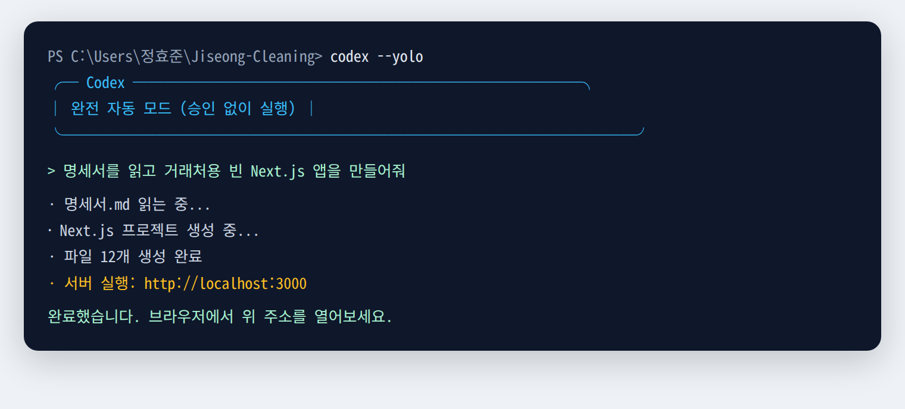

# Codex CLI로 지성크리닝 앱 만들기 — 교육 매뉴얼

> 대상: **코딩을 전혀 모르는 사람**
> 환경: **Windows** / 로그인: **ChatGPT 구독 계정**
> 실행 방식: `codex --dangerously-bypass-approvals-and-sandbox` (완전 자동 모드)

이 문서는 처음부터 끝까지 순서대로 따라 하면 됩니다. 모르는 단어가 나와도 괜찮습니다. 아래 설명대로 **똑같이 입력**만 하면 됩니다.

---

## 0장. Codex CLI가 무엇인가요?

**한 줄 요약:** 사람 말(한국어)로 "이런 거 만들어줘"라고 하면, **컴퓨터가 알아서 코드를 짜주는 인공지능 비서**입니다.

- **CLI**란 "까만 화면(터미널)에 글자로 명령하는 방식"을 말합니다. 마우스 클릭이 아니라 글자를 칩니다.
- Codex는 그 까만 화면 안에서 대화하듯 지시하면, 파일을 만들고 코드를 쓰고 실행까지 해줍니다.

### 할 수 있는 것
- 우리가 가진 **명세서·설계서를 읽고** 그대로 코드를 작성
- 화면(웹 페이지), 서버, 데이터베이스 같은 걸 만들어줌
- 에러가 나면 스스로 고치기도 함

### 못 하는 것 (중요 — 기대치 조절)
- **사업적 결정은 대신 못 함** (요금 얼마, 결제사 어디 쓸지 등은 사람이 정해줘야 함)
- **완벽하지 않음** — 가끔 틀리거나 엉뚱하게 만듦. 그래서 **사람이 확인**해야 함 (7장 참고)
- **결제사 계약, 앱스토어 등록** 같은 "코드 밖의 일"은 못 함

> 💡 핵심 마음가짐: Codex는 "똑똑하지만 실수하는 신입 개발자"입니다. 지시를 명확히 주고, 결과를 확인하는 게 우리 일입니다.

---

## 1장. 사전 준비물 설치 (Codex 설치 전에 먼저!)

Codex를 쓰려면 컴퓨터에 **재료 4가지**를 먼저 깔아야 합니다. 순서대로 설치하세요.

### 준비물 목록
| 프로그램 | 왜 필요한가 | 걸리는 시간 |
| --- | --- | --- |
| ① Node.js | Codex를 설치하는 도구 (필수) | 5분 |
| ② Git | 작업을 저장하고 되돌리는 도구 (사고 방지 필수) | 5분 |
| ③ VS Code | 만들어진 결과물을 눈으로 보는 프로그램 | 5분 |
| ④ ChatGPT 계정 | Codex 로그인용 (Plus 또는 Pro 구독) | 이미 있으면 생략 |

---

### ① Node.js 설치 (가장 중요)

1. 웹 브라우저에서 **https://nodejs.org** 접속
2. 큰 초록색 버튼 중 **"LTS"** 라고 적힌 버전을 다운로드 (안정 버전이라는 뜻)
   - ⚠️ 반드시 **버전 22 이상**이어야 합니다. LTS를 받으면 자동으로 충족됩니다.
3. 다운로드된 파일을 실행 → **"Next(다음)"만 계속 누르면** 설치 완료
4. 설치 확인: 아래 "터미널 여는 법"으로 터미널을 열고 다음을 입력

   ```bash
   node --version
   ```

   `v22.x.x` 같은 숫자가 나오면 성공입니다.

#### 📌 터미널(까만 화면) 여는 법 — Windows
- 키보드에서 **Windows 키**를 누르고 `terminal` 또는 `powershell`이라고 타이핑
- **"Windows Terminal"** 또는 **"Windows PowerShell"**을 클릭해서 실행
- 앞으로 "터미널에 입력하세요"라고 하면 이 창을 말합니다.

---

### ② Git 설치 (되돌리기 안전장치 — 꼭 설치)

우리는 완전 자동 모드(`--yolo`)를 쓸 거라, Codex가 실수해도 막을 수 없습니다.
그래서 **"저장 지점"을 만들어 언제든 되돌릴 수 있는** Git이 반드시 필요합니다.

1. **https://git-scm.com/download/win** 접속 → 자동으로 다운로드 시작
2. 실행 후 **"Next"만 계속 눌러** 설치 (옵션 그대로 두면 됨)
3. 확인: 터미널에 입력

   ```bash
   git --version
   ```

   `git version 2.x.x` 나오면 성공.

---

### ③ VS Code 설치 (결과물 보는 창)

1. **https://code.visualstudio.com** 접속 → **Download for Windows** 클릭
2. 실행 후 설치 (설치 중 **"Code로 열기" 관련 체크박스는 모두 켜두면** 편합니다)
3. 이건 나중에 "Codex가 만든 것을 눈으로 볼 때" 씁니다.

---

### ④ ChatGPT 계정 (Plus 또는 Pro)

- Codex를 쓰려면 **ChatGPT 유료 구독**이 필요합니다 (Plus 또는 Pro).
- 이미 구독 중이면 그 계정을 그대로 씁니다. 없으면 https://chatgpt.com 에서 구독하세요.
- 비용 관련 자세한 내용은 **3장**에서 다룹니다.

---

## 2장. Codex CLI 설치

준비물이 다 깔렸으면 이제 Codex 본체를 설치합니다.

1. 터미널을 엽니다.
2. 아래 명령을 **정확히** 복사해서 붙여넣고 Enter:

   ```bash
   npm install -g @openai/codex
   ```

   > ⚠️ **주의:** 반드시 `@openai/codex` 여야 합니다.
   > `codex`만 치면 전혀 다른(2012년의 무관한) 프로그램이 깔립니다. 이게 가장 흔한 실수입니다.

3. 설치가 끝나면 (1~2분 소요) 확인:

   ```bash
   codex --version
   ```

   아래처럼 **버전 숫자**가 나오면 성공입니다. (숫자는 조금 달라도 됩니다.)

   ```text
   > codex --version
   codex-cli 0.30.0
   ```

### 잘 안 될 때
- **"codex is not recognized(인식할 수 없음)"** 라고 나오면 → 터미널을 **완전히 껐다가 다시 열고** 다시 시도하세요. 설치 후 재시작이 필요합니다.
- 그래도 안 되면 → `winget install OpenAI.Codex` 명령으로 대신 설치할 수 있습니다.

---

## 3장. 로그인과 비용

### 로그인 (ChatGPT 계정으로)

1. 터미널에 입력:

   ```bash
   codex login
   ```

2. 자동으로 **웹 브라우저 창이 열립니다.**
3. 평소 쓰던 **ChatGPT 계정으로 로그인**하고, "허용/Authorize" 버튼을 누릅니다.
4. 브라우저에 "로그인 완료" 비슷한 메시지가 뜨면 창을 닫습니다. 터미널로 돌아오면 됩니다.

> 한 번 로그인하면 계속 유지됩니다. 매번 할 필요 없습니다.

### 비용 이해 (중요)

- **ChatGPT 구독(Plus/Pro) 로그인**을 쓰면, 구독 요금 안에서 Codex를 쓸 수 있습니다.
- 즉 **월 구독료 외에 추가 요금 걱정이 적습니다.** (초보자에게 이 방식을 추천하는 이유)
- 단, 아주 많이 쓰면 **사용량 한도**에 걸릴 수 있습니다. 한도에 걸리면 잠시 기다렸다가 다시 쓰면 됩니다.
- Pro가 Plus보다 한도가 훨씬 넉넉합니다. 앱을 본격적으로 만들 거라면 **Pro를 권장**합니다.

---

## 4장. 첫 실행 — 완전 자동(`--yolo`) 모드

### 실행 명령

우리가 쓸 실행 명령은 이것입니다:

```bash
codex --dangerously-bypass-approvals-and-sandbox
```

이건 타이핑하기 길어서, **똑같은 짧은 명령**도 있습니다:

```bash
codex --yolo
```

둘은 **완전히 같은 명령**입니다. 편한 걸 쓰세요.

실행하면 터미널이 대략 이렇게 보이고, 아래에 한국어로 지시를 입력하면 됩니다:



### 이 모드가 뭔가요?

- 보통 Codex는 뭔가 할 때마다 **"이거 실행해도 돼요? (예/아니오)"**를 계속 물어봅니다.
- 코딩을 모르면 그게 뭔지 판단이 안 돼서 오히려 막힙니다.
- `--yolo` 모드는 **그 질문 없이 Codex가 알아서 다 진행**합니다. 초보자가 흐름을 안 끊고 갈 수 있습니다.

### ⚠️ 대신 꼭 지켜야 할 안전 수칙

이 모드는 "허락 없이 뭐든 실행"이라, Codex가 실수해도 **막을 기회가 없습니다.** 그래서:

1. **작업 시작 전 항상 저장 지점 만들기** (8장의 Git 사용법) — 이게 안전벨트입니다.
2. **중요한 다른 파일이 있는 폴더에서는 실행하지 않기.** 오직 **지성크리닝 프로젝트 폴더 안에서만** 실행하세요.
3. 이상하게 흘러가면 언제든 **저장 지점으로 되돌리기** 가능합니다 (8장).

> 요약: `--yolo`는 편하지만 "안전벨트(Git 저장)"를 반드시 함께 써야 합니다.

---

## 5장. 프로젝트 폴더와 문서 세팅

Codex가 **우리 명세서·설계서를 읽고** 그에 맞게 만들도록 준비합니다.

### 폴더 구조 (이미 이렇게 되어 있음)

```
Jiseong-Cleaning/           ← 프로젝트 폴더 (여기서 codex 실행)
└── Document/
    ├── 명세서.md                    ← 무엇을 만들지 (B2B)
    ├── 개발 설계서.md                ← 어떻게 만들지 (B2B)
    ├── 결정사항.md                  ← Codex가 따를 확정 지침
    ├── 결정-워크시트.md             ← 대표·팀장이 정할 항목(초안)
    ├── 품목-단가표.md               ← 품목·단가 기준 (데모 시드)
    ├── 4일-집중-개발일정.md          ← 4일 데모 일정
    ├── 일일-학습과제.md             ← 전체 완성 과제
    ├── 정효준-개발이해-교육가이드.md   ← 앱 이해·설계 능력
    └── codex-사용-교육매뉴얼.md      ← 지금 이 문서
```
> (`images/` 폴더에는 화면 예시 이미지가 들어 있습니다. 그 외 파일은 Document 폴더에서 직접 확인하세요.)

### 🎨 목업 시안 활용하기 (디자인 정답지 + 결정 도구)

우리에게는 **화면 시안 사이트**가 있습니다. Codex에게 "이 화면처럼 만들어줘"라고 보여줄 **눈으로 보는 정답지**입니다.

**목업 주소:** https://jazzy-zuccutto-64ec58.netlify.app/

이 사이트는 두 가지로 씁니다.

**(1) 결정 도구로 쓰기 — 먼저 할 일**
- 사이트에서 역할(거래처(업체) 담당자/기사/세탁공장/관리자)별 화면을 보며 **결정 항목들**을 정합니다. (정리된 목록은 `결정-워크시트.md` 참고)
- 다 정했으면 **"요약 복사" 또는 "파일 저장(.md)"** 버튼으로 결정 내용을 내보냅니다.
- 내보낸 파일을 `Document/결정사항.md` 로 저장해 프로젝트에 넣습니다.
- 이 파일이 **Codex에게 줄 "확정된 지침서"**가 됩니다. (미결정 상태로 시작하면 Codex가 임의로 만들어 나중에 갈아엎게 됩니다.)

**(2) 디자인 참고로 쓰기 — 만들 때마다**
- 특정 화면을 만들 때, 그 목업 화면을 **스크린샷으로 찍어** Codex에게 보여주세요.
- Codex는 이미지를 붙여 지시할 수 있습니다:
  ```
  codex --yolo --image 스크린샷.png
  ```
  또는 대화 중에 이미지를 첨부하고 "이 목업 화면과 똑같이 만들어줘"라고 하면 됩니다.

> 요약: **목업에서 결정 → `.md`로 내보내 프로젝트에 넣기 → 화면은 스크린샷으로 보여주기.**
> 이 세 가지가 Codex가 헤매지 않게 하는 가장 강력한 방법입니다.

### 만들 4개 역할 화면 (목업 기준)

| 역할 | 하는 일 | 우리 계획 |
| --- | --- | --- |
| **거래처** | 세탁 발주·정산·발주 조회 | 거래처용 웹 |
| **기사(직원)** | 수거·납품, 현장 상태 변경 | 관리자 모바일 웹 |
| **세탁공장** | 세탁 작업 상태 관리 | 관리자 웹(세탁 파트) |
| **관리자** | 전체 발주·가격·거래처·통계 | 관리자 PC 웹 |

이 4개 모두 **하나의 서버**에 연결되어, 한 곳에서 바꾼 내용이 다른 곳에 즉시 반영됩니다.

### 프로젝트 폴더로 이동하기

터미널에서 아래처럼 프로젝트 폴더로 들어갑니다 (`cd`는 "폴더 이동" 명령):

```bash
cd 지성크리닝_폴더_경로
```

폴더 경로를 모르면 **VS Code로 폴더를 열고 → 터미널을 VS Code 안에서 열면** 자동으로 그 폴더에 있게 됩니다. (VS Code 상단 메뉴 `Terminal → New Terminal`)

### AGENTS.md 만들기 (Codex 전용 설명서 — 매우 중요)

`AGENTS.md`는 **"Codex야, 이 프로젝트는 이런 거야"라고 미리 알려주는 쪽지**입니다.
이걸 잘 써두면 Codex가 매번 헤매지 않고 우리가 원하는 방향으로 만듭니다.

Codex 안에서 아래 슬래시 명령을 치면 기본 뼈대가 자동 생성됩니다:

```
/init
```

그다음, 생성된 `AGENTS.md` 파일에 아래 내용을 채워 넣으라고 Codex에게 부탁하세요. (그대로 복사해서 지시하면 됩니다.)

> **AGENTS.md 에 넣을 내용 예시:**
>
> ```markdown
> # 지성크리닝 프로젝트
>
> ## 이 프로젝트는 무엇인가
> 세탁물 수거 → 세탁 → 납품을 처리하는 **도매(B2B) 세탁 서비스**다.
> **개인 고객이 아니라 업체(거래처)에서만** 세탁물을 받는다. 예: 호텔 침구·수건, 식당 앞치마 등을 대량으로 수거·세탁·납품.
> 따라서 "고객"이라는 말은 전부 **"거래처(업체)"**로 이해하고 만들어라. 품목은 업소용을 대량 수량으로 다룬다.
> 상세 요구사항은 `Document/명세서.md`, 기술 설계는 `Document/개발 설계서.md`, 확정값은 `Document/결정사항.md`에 있다.
> 코드를 짜기 전에 반드시 이 문서들을 먼저 읽어라. (명세서의 "고객"은 "거래처"로 바꿔 해석한다.)
>
> ## 만들 대상 (1차 목표)
> - 거래처용 웹, 관리자 PC 웹, 관리자 모바일 웹 (전부 반응형 웹으로 시작)
> - 백엔드 서버 1개 + 데이터베이스 1개
> - 안드로이드 앱은 나중 단계다. 지금은 웹으로 만든다.
>
> ## 지켜야 할 규칙
> - 한 번에 하나의 기능만 완성하고 멈춰서 설명해라.
> - 결제·본인인증은 진짜 연동 대신 "가짜(테스트용)"로 먼저 만들어라.
> - 금액 계산은 서버에서 한다. 화면에서 보낸 금액을 믿지 마라.
> - 모든 설명과 주석은 한국어로 써라.
> - 큰 변경을 하기 전에 무엇을 할지 먼저 한국어로 요약해라.
> ```

이 쪽지 하나가 앱 품질을 크게 좌우합니다. 정성 들여 써두세요.

---

## 6장. ⭐ Codex에게 지시 잘 하는 법 (가장 중요한 기술)

코딩을 몰라도 됩니다. 대신 **"지시를 잘 하는 능력"**이 실력입니다. 아래 5가지 원칙만 지키세요.

### 원칙 1. 크게 시키지 말고 잘게 쪼개서 시켜라
- ❌ 나쁜 예: "지성크리닝 앱 전부 만들어줘" → Codex가 뒤죽박죽 만듭니다.
- ✅ 좋은 예: "먼저 관리자가 세탁 품목을 등록하는 화면 하나만 만들어줘"

### 원칙 2. 문서를 가리켜라
- ✅ "`Document/명세서.md`의 4.9 상품 및 가격 관리 부분을 읽고, 그 화면을 만들어줘"
- Codex는 우리 문서를 직접 읽을 수 있습니다. 매번 참고하라고 알려주세요.

### 원칙 3. 한 번에 하나씩, 확인하고 다음으로
- 하나 만들면 → **실제로 실행해서 눈으로 확인**(7장) → 잘 되면 다음 지시
- 여러 개를 몰아서 시키면 어디서 틀렸는지 못 찾습니다.

### 원칙 4. 모르면 "쉽게 설명해줘"라고 해라
- Codex는 선생님이기도 합니다.
- ✅ "방금 만든 게 뭔지 코딩 모르는 사람도 알게 쉽게 설명해줘"
- ✅ "이 에러가 무슨 뜻이야? 어떻게 해결해?"

### 원칙 5. 원하는 걸 구체적으로 그려줘라
- ❌ "발주 화면 만들어줘"
- ✅ "거래처 담당자가 세탁 품목을 고르고, 수량을 +/- 버튼으로 조절하고, 아래에 예상 금액이 자동으로 바뀌는 화면을 만들어줘"

### 실전 지시문 예시 (복사해서 응용하세요)

```
Document/명세서.md 와 Document/개발 설계서.md 를 먼저 읽어줘.
그다음, 데모용 경량 스택(Next.js + SQLite)으로 프로젝트 기본 뼈대만 만들어줘.
아직 기능은 넣지 말고, '서버가 켜지고 빈 화면이 뜨는 것'까지만 하고 멈춰서 한국어로 설명해줘.
```

> 💡 **데모 vs 정식 스택:** 4일 데모는 명령 하나로 실행되는 **Next.js + SQLite**로 만듭니다.
> 마감 이후 정식 개발은 설계서 2장의 스택(백엔드 Spring Boot, DB PostgreSQL, 웹 React)으로 다시 짓습니다.
> 지금(데모)은 반드시 **Next.js + SQLite**로 지시하세요. (섞으면 초보자가 실행에서 막힙니다.)

---

## 7장. 결과 확인법 (코딩 몰라도 검증하기)

Codex가 "다 만들었어요"라고 해도 **그대로 믿지 마세요.** 아래 방법으로 직접 확인합니다.

### 방법 1. 실제로 실행해서 눈으로 보기 (가장 확실)
- Codex에게 이렇게 말하세요:
  ```
  방금 만든 걸 지금 실행해서, 내가 웹브라우저에서 직접 볼 수 있게 해줘.
  어떤 주소로 접속하면 되는지 알려줘.
  ```
- Codex가 `http://localhost:3000` 같은 주소를 알려주면, 브라우저 주소창에 넣어 **직접 눈으로 확인**합니다.

### 방법 2. 무엇이 바뀌었는지 보기
- Codex 안에서 슬래시 명령:
  ```
  /diff
  ```
- 이번에 어떤 파일이 어떻게 바뀌었는지 보여줍니다. (내용을 다 이해할 필요는 없고, "뭔가 바뀌었구나" 정도만 봐도 됩니다)

### 방법 3. 설명 요청
- ```
  방금 한 작업을 코딩 모르는 사람이 이해하게 항목별로 요약해줘.
  ```

### 확인 체크리스트
- [ ] 실행하면 실제로 화면이 뜨는가?
- [ ] 명세서에서 원한 대로 동작하는가?
- [ ] 에러 메시지가 빨간색으로 잔뜩 뜨지는 않는가?
- 문제가 있으면 → 그 화면/에러를 **그대로 복사해서 Codex에게 붙여넣고** "이거 고쳐줘"

---

## 8장. 막혔을 때 & 되돌리기 (안전장치)

### 맨 처음 한 번만: git 준비 (저장소 만들기)

프로젝트 폴더는 처음엔 git 저장소가 아닙니다. **딱 한 번**, 아래를 실행해 준비하세요. (안 하면 "not a git repository" 에러가 납니다.)

```bash
git init
git config --global user.name "이름"
git config --global user.email "이메일@example.com"
```

> Codex 안에서 `이 폴더를 git 저장소로 만들고, 내 이름과 이메일도 설정해줘` 라고 부탁해도 됩니다.

### 저장 지점 만들기 (작업 전마다 습관화 — `--yolo` 필수 안전벨트)

위 준비가 끝났으면, 새 작업을 시작하기 **전에** 아래 2줄로 "현재 상태"를 저장해 두세요:

```bash
git add -A
git commit -m "작업 전 저장"
```

혹은 그냥 Codex에게 부탁해도 됩니다:
```
지금 상태를 git으로 저장해줘. 나중에 되돌릴 수 있게.
```

### 잘못됐을 때 되돌리기

Codex가 엉망으로 만들었으면, 마지막 저장 지점으로 되돌립니다:

```
방금 작업을 취소하고, 마지막으로 git에 저장했던 상태로 되돌려줘.
```

이게 `--yolo` 모드의 **생명줄**입니다. 자주 저장할수록 안전합니다.

### 에러가 났을 때
1. 빨간 글자(에러)를 **마우스로 드래그해서 전체 복사**
2. Codex에게 붙여넣고: `이 에러가 났어. 무슨 뜻이고 어떻게 고쳐?`
3. Codex가 고쳐줍니다. 안 되면 한 번 더, 그래도 안 되면 8장의 "되돌리기"로.

### 작업 이어서 하기 (다음 날, 컴퓨터 껐다 켠 뒤)
- 지난 대화를 이어가려면:
  ```bash
  codex resume --last
  ```
  → 가장 최근 작업을 이어서 합니다.
- 이전 여러 작업 중 고르려면 `codex resume` (목록에서 선택)

---

## 9장. 지성크리닝 실전 빌드 로드맵 (무엇을 어떤 순서로 시킬까)

한 번에 다 만들려 하면 반드시 실패합니다. **아래 순서대로** Codex에게 시키세요.
각 단계가 끝나면 7장으로 확인하고, 8장으로 저장한 뒤 다음 단계로 갑니다.

> ⚠️ 시작 전 필수: 아래 5가지를 먼저 정해야 Codex가 헛발질을 안 합니다.
> (명세서 8장 / 설계서 19장의 "확정 필요 사항", `결정-워크시트.md`에서 발췌)
> 1. 정산 방식 (월 마감 후불 정산 / 건별 / 세금계산서·계좌이체)
> 2. 로그인 방식 (관리자 계정 발급 / 아이디·비번 / 담당자 휴대폰 인증)
> 3. 서비스 지역과 단가 (거래처 계약 단가·수거·납품비)
> 4. 미승인 거래처의 발주 허용 여부
> 5. 관리자 모바일 = 반응형 웹 ✅ (이미 정함)
>
> 아직 안 정했으면 → 초기에는 "가짜(테스트용)"로 만들고 나중에 진짜로 교체하면 됩니다.

### 단계별 지시 순서

| 단계 | Codex에게 시킬 것 | 완료 기준 |
| --- | --- | --- |
| **1** | 프로젝트 뼈대 + 로그인(가짜 인증) | 서버가 켜지고 로그인 화면이 뜬다 |
| **2** | 관리자 PC 웹 — 품목·가격 등록, 발주 목록 | 관리자가 품목을 등록하고 목록을 본다 |
| **3** | 거래처용 웹 — 발주 신청 → 예상금액 → 완료 | 거래처 담당자가 발주를 넣으면 관리자 화면에 뜬다 |
| **4** | 관리자 모바일 웹 — 수거·검수·납품 상태 변경 | 현장에서 상태를 바꾸면 거래처 화면에 반영된다 |
| **5** | 진짜 결제·알림 연동 | 실제 결제·푸시가 동작한다 (결제사 계약 필요) |

### 각 단계 시작 지시문 (예시)

**1단계:**
```
Document/개발 설계서.md 의 18.1 '1단계: 기반 구축'을 읽어줘.
그 내용대로 프로젝트 기본 뼈대와, 가짜 로그인 기능만 만들어줘.
지금은 실제 휴대폰 인증 대신 아무 번호나 넣으면 로그인되는 테스트용으로 해줘.
다 되면 실행해서 로그인 화면을 브라우저에서 볼 수 있게 해줘.
```

**2단계:**
```
이제 Document/명세서.md 의 4.9 '상품 및 가격 관리'를 읽고,
관리자가 세탁 품목과 가격을 등록/수정하는 PC 웹 화면을 만들어줘.
등록한 품목이 목록으로 보여야 해.
```

이런 식으로 **명세서의 해당 항목을 가리키며** 하나씩 시켜나가면 됩니다.

---

## 10장. 명령어 치트시트 & 자주 하는 실수

### 자주 쓰는 터미널 명령
| 명령 | 뜻 |
| --- | --- |
| `codex --yolo` | Codex 완전 자동 모드로 시작 |
| `codex resume --last` | 지난 작업 이어서 하기 |
| `codex --version` | 설치 확인 |
| `codex login` | 로그인 |
| `cd 폴더경로` | 폴더 이동 |
| `git add -A` + `git commit -m "메모"` | 현재 상태 저장(안전벨트) |

### Codex 대화 안에서 쓰는 슬래시 명령 (`/` 로 시작)
| 명령 | 뜻 |
| --- | --- |
| `/init` | AGENTS.md 쪽지 뼈대 만들기 |
| `/diff` | 이번에 바뀐 내용 보기 |
| `/model` | 사용할 AI 모델 바꾸기 |
| `/compact` | 대화가 너무 길어졌을 때 요약(정리) |
| `/exit` | Codex 종료 |

### 자주 하는 실수 TOP 5
1. **`npm install -g codex`** 로 잘못 설치 → 반드시 **`@openai/codex`**
2. **저장(git) 안 하고** `--yolo` 쓰다가 되돌릴 수 없게 됨 → 작업 전마다 저장
3. **한 번에 다 시키기** → 잘게 쪼개서 하나씩
4. **결과 확인 안 하고** 다음으로 넘어감 → 매번 실행해서 눈으로 확인
5. **에러를 요약해서 전달** → 에러는 **전체를 그대로 복사**해서 붙여넣기

### 교육할 때 강조할 핵심 3가지
1. Codex는 **똑똑한 신입**이다 — 명확히 지시하고 결과를 확인하라.
2. `--yolo`는 편하지만 **git 저장이 안전벨트**다.
3. **명세서·설계서를 항상 가리키며** 하나씩 시켜라.

---

## 부록. 참고 링크
- Codex CLI 설치(npm): https://www.npmjs.com/package/@openai/codex
- Codex 공식 개발자 명령어 문서: https://developers.openai.com/codex/cli/reference
- Node.js: https://nodejs.org
- Git for Windows: https://git-scm.com/download/win
- VS Code: https://code.visualstudio.com
</content>
</invoke>
