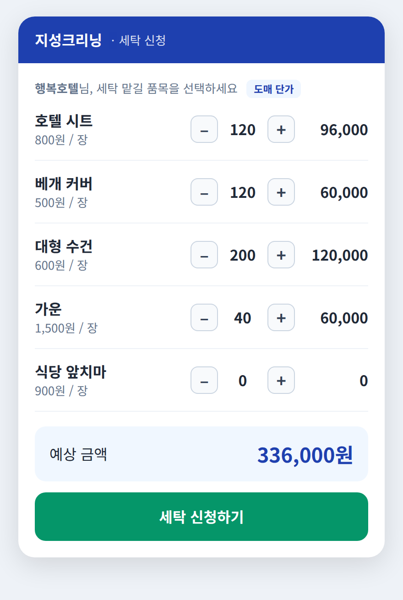
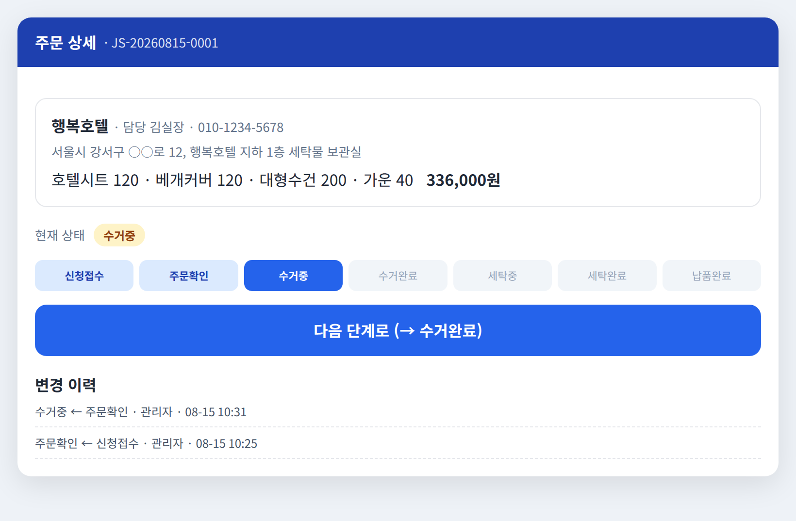
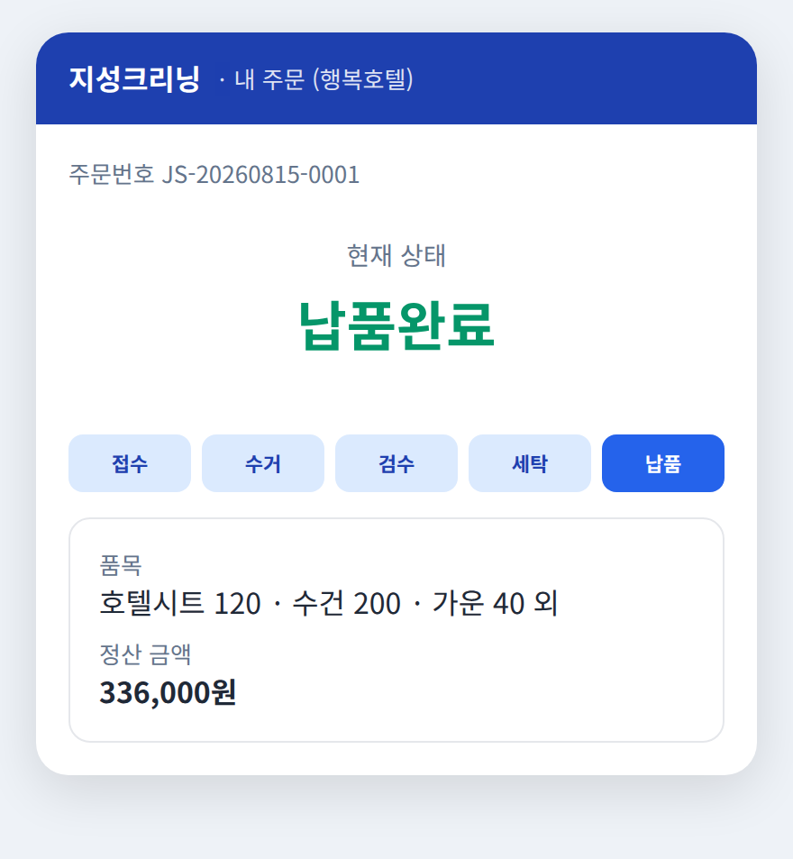

# 앱 개발·기능 설계 이해 가이드 (정효준용)

> 대상: **정효준** — 코딩은 못 하지만, Codex로 지성크리닝 앱을 만들 사람
> 목표: **대표님·팀장님과 기능/요구사항을 대화**하고, 그 요구를 **Codex가 알아들을 설계로 바꾸는** 능력 기르기
> 짝 문서: `codex-사용-교육매뉴얼.md` (이건 "어떻게 만드나", 이 문서는 "무엇을·왜 만드나")

---

## 이 가이드를 왜 읽나요?

당신은 **"다리 역할"**입니다.

```
대표님·팀장님 ─(이런 거 만들어줘)→ [정효준] ─(이렇게 만들어)→ Codex ─→ 앱
```

- 대표·팀장은 **서비스는 알지만 기술은 모릅니다.**
- Codex는 **기술은 알지만 우리 서비스가 뭘 원하는지 모릅니다.**
- **당신이 그 사이를 통역**합니다. 코드는 몰라도 됩니다. 대신 **"양쪽 말을 다 알아듣는 능력"**이 필요합니다.

이 가이드는 그 능력을 5부로 나눠 길러줍니다.

| 부 | 배우는 것 | 이걸 알면 |
| --- | --- | --- |
| A | 앱이 무엇으로 이뤄지나 (기본 어휘) | 기술 대화의 기본기 |
| B | 지성크리닝 서비스 완전 이해 | 대표·팀장과 같은 언어로 대화 |
| C | 요구사항을 대화로 끌어내는 법 | "이 기능 되나요?"에 답하기 |
| D | 요구를 설계로 바꾸는 법 | Codex에게 줄 지시 만들기 |
| E | 현실 감각 (기간·비용·한계) | 헛된 약속 안 하기 |

---

# A부. 앱은 무엇으로 이뤄지나 (기본 어휘)

기술 용어 몇 개만 알면 대화의 90%가 됩니다. **식당 비유**로 외우세요.

### 앱을 식당에 비유하면

| 앱 용어 | 식당 비유 | 지성크리닝 예시 |
| --- | --- | --- |
| **프론트엔드(화면)** | 손님이 보는 홀·메뉴판 | 거래처가 보는 발주 화면 |
| **백엔드(서버)** | 주방 | 금액 계산, 발주 처리 |
| **데이터베이스(DB)** | 창고·장부 | 발주·거래처·가격 저장 |
| **API** | 홀↔주방 주문서 | 화면이 서버에 "발주 저장해줘" 요청 |
| **외부 연동** | 배달대행·카드단말기 | 정산사, 문자, 지도 (남의 회사 것) |
| **배포** | 개업(문 열기) | 실제 인터넷에 올려 거래처가 쓰게 |

### 여기서 나오는 핵심 3가지

1. **화면 하나를 만들려면 보통 3개가 같이 필요합니다:** 화면(프론트) + 처리(백엔드) + 저장(DB).
   - 그래서 "간단한 화면"도 뒤에서는 세 군데가 움직입니다. 대표가 "이거 금방 되죠?"라고 할 때, 화면만 보고 판단하면 안 되는 이유입니다.

2. **"외부 연동"은 우리 맘대로 안 됩니다.** 결제·문자·본인인증·지도는 **남의 회사 서비스**라 계약·심사·비용이 듭니다. (E부에서 상세)

3. **한 곳에서 바꾸면 다 바뀌어야 합니다.** 기사가 "수거 완료"를 누르면, 거래처 화면·관리자 화면에 즉시 반영. 이게 되는 이유는 **모두 같은 서버·DB 하나**를 쓰기 때문입니다.

> 🗣️ 대화에서 이렇게 씁니다:
> - 대표: "거래처가 쿠폰 쓰게 해줘"
> - 정효준(속으로): 화면(쿠폰 입력칸) + 서버(할인 계산) + DB(쿠폰 저장) + 관리자 화면(쿠폰 발급). → "네, 되는데 화면 하나가 아니라 거래처·관리자 양쪽 + 계산 로직이 필요해서 조금 걸려요."

---

# B부. 지성크리닝 서비스 완전 이해

대표·팀장과 대화하려면 **우리 서비스를 그들만큼 알아야** 합니다. 명세서·설계서의 핵심만 뽑았습니다.

> ## ⚑ 가장 먼저: 우리는 "도매(B2B)"다
>
> **지성크리닝은 개인 손님의 옷을 받지 않습니다. 오직 업체(거래처)에서만 세탁물을 받습니다.**
> 즉 우리 "고객"은 개인이 아니라 **거래처(사업체)**입니다. 예: 호텔·모텔의 침구/수건, 식당의 앞치마/행주, 헬스장의 수건/가운 등을 **대량으로** 수거해 세탁하고 납품합니다.
>
> 이 사실이 앱 전체의 성격을 바꿉니다:
> - "고객" = **거래처(업체 담당자)**. 개인 회원가입이 아니라 **거래처 계정**.
> - 품목 = 개인 옷 1~2장이 아니라 **업소용 품목(시트·수건·가운·앞치마 등)을 수십~수백 장 단위**로.
> - 결제 = 건별 카드결제보다 **월 정산·세금계산서**가 흔함 (정식 개발 때 반영).
> - 배송 = "배송"보다 **납품(업체로 다시 갖다줌)** 개념.
>
> ⚠️ **원본 명세서·설계서는 개인 고객(B2C) 기준으로 쓰여 있습니다.** 실제 사업(도매)과 차이가 있으니, 이 부분은 **대표·팀장과 반드시 확인**하고 `결정사항.md`에 반영하세요. 이 교육 자료의 데모·예시는 **실제 사업(도매/거래처)에 맞춰** 조정했습니다.

### B-1. 서비스 한 줄 흐름

```
신청 → 발주확인 → 수거 → 검수(실물 확인·금액 확정)
→ 거래처 최종금액 승인 → 정산 → 세탁 → 납품 → 완료
```

**가장 중요한 개념 = 검수.** 거래처가 신청할 땐 **"예상 금액"**만 나옵니다. 기사가 실제 세탁물을 수거해 수량·상태를 확인(검수)한 뒤 **"최종 금액"**이 확정되고, 거래처가 다시 승인합니다. (실제 맡긴 수량·오염 상태를 봐야 정확한 도매 금액이 나오니까요.)

### B-2. 4개 역할 (목업 기준)

| 역할 | 하는 일 | 주로 쓰는 화면 |
| --- | --- | --- |
| **거래처(업체)** | 세탁 발주·정산·발주조회·문의 | 거래처용 웹 |
| **기사(직원)** | 수거·납품, 현장 상태 변경, 사진 | 관리자 모바일 웹 |
| **세탁공장** | 세탁 대기·진행·완료 관리 | 세탁 화면 |
| **관리자** | 발주·단가·거래처·통계 총괄 | 관리자 PC 웹 |

> 여기서 **"거래처"가 곧 우리 "고객"**입니다. 원본 명세서에 나오는 "고객"을 **"거래처(업체)"로 바꿔 읽으면** 실제 사업과 맞습니다.

**우리가 만들 화면 미리보기** (4일 데모 기준 — 이런 걸 만듭니다):

| 거래처: 발주 신청 | 관리자: 상태 변경 | 거래처: 상태 확인 |
| :---: | :---: | :---: |
|  |  |  |

> 대표·팀장과 대화할 때 이 화면들을 같이 보면 "이렇게 만들면 되죠?" 확인이 쉽습니다.

### B-3. 발주 상태 (이걸 알면 대화가 쉬워짐)

발주는 여러 **상태**를 거칩니다. 상태를 알면 "지금 어느 단계 얘기인지" 서로 통합니다.

`신청 접수 → 발주 확인 → 수거 예정 → 수거 중 → 수거 완료 → 품목 검수 → (거래처 승인 대기) → 정산 대기 → 세탁 대기 → 세탁 중 → 세탁 완료 → 납품 예정 → 납품 중 → 납품 완료`

예외 상태도 있음: `발주 거절 / 발주 취소 / 수거 실패 / 정산 실패 / 처리 보류 / 재세탁 / 환불 진행 / 환불 완료`

> 💡 규칙 하나만 기억: **모든 상태 변경은 "누가·언제·왜 바꿨는지" 기록**됩니다. 대표가 "누가 취소했는지 알 수 있어?" 물으면 → "네, 이력이 남습니다."

### B-4. 돈의 흐름

```
예상 금액(신청 시) → 검수 → 최종 금액(확정) → 정산 → (문제 시) 환불
```

- **금액 계산은 반드시 서버가** 합니다. 화면에서 보낸 금액을 믿으면 안 됨(조작 위험). 이건 Codex에게도 꼭 강조할 원칙입니다.
- 환불은 **부분 환불/전체 환불**이 있고, **환불 합계가 정산액을 넘으면 안 됩니다.**

### B-5. MVP (처음엔 여기까지만)

명세서가 정한 **초기 출시(MVP)**에 들어가는 것과 **나중으로 미룬 것**:

- ✅ **지금 만듦:** 가입·로그인, 발주 신청·조회·취소, 검수·최종금액, 정산·환불, 상태 알림, 관리자 발주·가격 관리, 기사 배정·현장처리
- ⏳ **나중에:** 기사 실시간 위치추적, **정기 구독 세탁**, 포인트·등급, 리뷰, AI 오염 판별, 자동 배차, iOS 앱

> 목업에 "구독" 옵션이 보이지만, 명세서상 구독은 **나중 단계**입니다. 대표가 구독을 원하면 → "MVP엔 건별 정산부터 넣고, 구독은 2차로 하시죠"라고 말할 수 있어야 합니다.

---

# C부. 요구사항을 대화로 끌어내는 법

대표·팀장이 "이런 거 해줘"라고 할 때, 그냥 받아 적지 말고 **아래 3가지를 하세요.**

### C-1. 모든 기능을 3분류로 판단하기

들은 요구를 머릿속에서 세 칸 중 하나에 넣으세요:

| 분류 | 특징 | 대답 예시 |
| --- | --- | --- |
| 🟢 **쉬움** | 화면·데이터만 있으면 됨 | "네, 만들 수 있어요" |
| 🟡 **시간 걸림** | 여러 화면·역할·계산 얽힘 | "되는데 화면 여러 개라 시간이 좀…" |
| 🔴 **외부·계약 필요** | 결제·문자·인증·앱스토어 | "그건 OO사 계약이 먼저 필요해요" |

이 분류만 할 줄 알아도 **"대화가 되는 사람"**이 됩니다. (E부에서 예시 상세)

### C-2. 요구를 들으면 되물을 4가지 질문

애매한 요구는 반드시 **되물어** 구체화하세요. 마법의 4질문:

1. **누가 쓰나요?** (거래처(업체) 담당자/기사/세탁공장/관리자 중 누구?)
2. **어느 화면에서요?** (신청 화면? 발주 상세? 관리자 목록?)
3. **어떤 정보가 필요해요?** (뭘 입력하고, 뭘 보여줘야 하나?)
4. **잘못되면 어떻게 하죠?** (재고 없으면? 정산 실패하면? 부재중이면?)

> 예: 대표 "거래처 담당자가 세탁 다 됐는지 알게 해줘"
> → 되묻기: "① 거래처 담당자가(누가) ② 발주 상세 화면에서(어디) ③ 현재 상태랑 예상 완료일을(무엇) 보게요? ④ 지연되면 알림도 보낼까요?(예외)"
> → 이렇게 정리하면 그대로 Codex 지시가 됩니다(D부).

### C-3. 목업을 함께 펼쳐놓고 결정하기

- 우리에겐 **목업 사이트**가 있습니다: https://jazzy-zuccutto-64ec58.netlify.app/
- 대표·팀장과 **목업 화면을 같이 보며** "이 버튼은 이렇게, 이 항목은 빼고" 식으로 결정하세요.
- 목업과 **`결정-워크시트.md`의 결정 항목들**을 다 정한 뒤 `Document/결정사항.md`에 반영하면, 그게 Codex에게 줄 확정 지침이 됩니다.
- **애매하면 미루지 말고 "가짜로 먼저" 카드를 쓰세요:** "정산사 아직 안 정했으면, 가짜 정산으로 먼저 만들고 나중에 진짜로 바꿀게요." → 개발이 안 멈춥니다.

---

# D부. 요구를 "설계"로 바꾸는 법 (→ 그대로 Codex 지시가 됨)

여기가 정효준의 **핵심 기술**입니다. 코딩이 아니라 **"기능을 4조각으로 쪼개는" 능력**입니다.

### D-1. 기능 = [화면] + [데이터] + [동작] + [예외]

어떤 기능이든 이 4조각으로 분해하세요.

- **화면**: 사용자가 보는 것 (버튼·입력칸·목록)
- **데이터**: 저장/표시할 정보
- **동작**: 버튼 누르면 무슨 일이
- **예외**: 잘못됐을 때

### D-2. 실전 예시 — "관리자가 세탁 품목을 등록"

| 조각 | 내용 |
| --- | --- |
| 화면 | 관리자 웹에 '품목 등록' 화면. 입력칸: 품목명, 분류, 기본가격, 노출여부. [저장] 버튼. 아래에 등록된 품목 목록 표 |
| 데이터 | 품목명(글자), 가격(숫자·원), 분류(의류/침구 등), 노출상태(켬/끔) |
| 동작 | [저장] 누르면 목록에 추가되고 화면에 바로 보임. 가격 바꾸면 이력이 남음 |
| 예외 | 가격을 안 넣거나 글자로 넣으면 "숫자를 입력하세요" 안내 |

**→ 이걸 그대로 Codex에게 붙여넣으면 지시 완성:**

```
Document/명세서.md의 4.9 '상품 및 가격 관리'를 읽어줘.
관리자 웹에 세탁 품목을 등록하는 화면을 만들어줘.
- 입력: 품목명, 분류, 기본가격(숫자, 원 단위), 노출여부
- 저장하면 아래 목록 표에 바로 보이게
- 가격 변경 시 이력이 남게
- 가격에 숫자가 아닌 값을 넣으면 안내 문구 표시
다 되면 실행해서 브라우저에서 보게 해줘.
```

### D-3. 큰 요구는 작은 기능들로 쪼개기

대표: "거래처가 세탁 발주하게 해줘" → 이건 너무 큽니다. 이렇게 쪼갭니다:

1. 납품지 선택 화면
2. 품목·수량·옵션 고르는 화면
3. 예상 금액 보여주기
4. 수거·납품 일정 고르기
5. 최종 확인 → 신청 완료

**하나씩** Codex에게 시키고, 하나 되면 확인하고 다음. (매뉴얼 6·7장)

> 💡 쪼개는 기준: "이 화면 하나만 있으면 눈으로 확인 가능한가?" 예/아니오로 나눌 수 있으면 잘 쪼갠 겁니다.

---

# E부. 현실 감각 (헛된 약속 안 하기)

대표·팀장 앞에서 **"그건 안 돼요"** 또는 **"그건 시간이 걸려요"**를 정확히 말할 수 있어야 신뢰받습니다.

### E-1. "계약·비용이 먼저"인 것들 (코드로 해결 안 됨)

| 요구 | 왜 바로 안 되나 | 대답 |
| --- | --- | --- |
| 진짜 카드 결제 | 결제대행사(PG) 계약·심사 필요 | "결제사 계약부터 하고, 그동안 가짜 정산으로 개발할게요" |
| 휴대폰 본인인증 | 인증 업체 계약·비용 | "인증사 정하기 전엔 테스트 로그인으로 갈게요" |
| 문자(SMS) 발송 | 문자 서비스 계약·건당 비용 | "문자는 비용이 들어서 꼭 필요한 알림만 정하죠" |
| 앱스토어 출시 | 구글 심사·개발자 등록 | "웹으로 먼저 열고, 앱 등록은 그다음에요" |

### E-2. "나중에" 카드 (명세서가 정한 후순위)

대표가 아래를 원하면 → **"좋은데 2차로 하시죠"**라고 말하세요:
기사 실시간 위치추적 · 정기 구독 · 포인트/등급 · 리뷰 · AI 오염판별 · 자동배차 · iOS 앱

### E-3. 개발은 "한 번에 완성"이 아니라 "단계별"

명세서가 정한 5단계 (매뉴얼 9장 로드맵과 동일):

```
1단계 뼈대·로그인 → 2단계 관리자 웹 → 3단계 거래처 신청
→ 4단계 현장(기사·세탁) → 5단계 진짜 결제·알림
```

각 단계가 끝날 때마다 **실제로 보여드리고** 피드백 받으세요. "다 만들고 한 번에 공개"는 반드시 실패합니다.

### E-4. 정효준이 절대 하면 안 되는 말 vs 해야 하는 말

| ❌ 하면 안 되는 말 | ✅ 대신 이렇게 |
| --- | --- |
| "그거 금방 돼요" (확인 없이) | "확인해보고 언제까지 될지 알려드릴게요" |
| "안 될 것 같은데요" (막연히) | "그건 OO 때문에 지금은 어렵고, 대신 이렇게는 돼요" |
| (모르는데) 아는 척 | "제가 잘 몰라서, 이건 확인 후 답할게요" |

---

# 부록 1. 대화 예시 (정효준 ↔ 대표·팀장)

**상황: 대표가 "물량 많은 거래처는 단가를 깎아주고 싶어"**

> 대표: 우리랑 거래 많이 하는 업체는 자동으로 단가 할인되게 해줘.
> 정효준: 좋아요. 몇 가지만 여쭤볼게요. ①"많이"의 기준이 뭘까요? 예를 들어 월 세탁량 얼마 이상, 또는 월 정산액 얼마 이상? ②할인은 금액이에요, 단가 비율이에요? ③모든 품목에요, 특정 품목(예: 시트·수건)만이에요?
> 대표: 월 정산액 100만 원 넘는 거래처는 단가 10% 깎아줘. 전체 다.
> 정효준: 알겠습니다. 그럼 (속으로: 🟡 시간 걸림 — 거래처별 월 정산액 집계 + 단가 계산 + 관리자 거래처 등급 설정 화면) — 만들 수 있는데, 거래처별 실적을 집계해서 자동 적용하는 부분이라 화면 하나짜리보단 조금 걸려요. MVP 이후 2차에 넣는 게 어떨까요? 지금은 관리자가 거래처별 단가를 직접 설정하는 것부터 열어두고요.
> 대표: 그래 그러자.

**포인트:** ① 4질문으로 구체화 ② 3분류로 난이도 판단 ③ 현실적 대안 제시. 코드 얘기는 한마디도 안 했습니다.

---

# 부록 2. 기술 용어 미니 사전 (대화용)

| 용어 | 쉬운 뜻 |
| --- | --- |
| 프론트엔드 | 사용자가 보는 화면 |
| 백엔드 | 뒤에서 처리하는 서버(주방) |
| 데이터베이스(DB) | 정보 저장 창고 |
| API | 화면과 서버가 주고받는 요청 |
| 배포 | 실제 인터넷에 올려 쓰게 하는 것 |
| 반응형 웹 | 화면 크기(PC/폰)에 맞춰 자동 변형되는 웹 |
| MVP | 최소 기능만 갖춘 첫 출시 버전 |
| 외부 연동 | 결제·문자·지도 등 남의 회사 서비스 붙이기 |
| 서버 | 앱의 두뇌 컴퓨터(주방) |
| 목업 | 실제 동작 전, 화면 생김새만 만든 시안 |

---

# 부록 3. 대표·팀장 미팅 체크리스트 (한 장 출력용)

> 회의에 이 한 장을 들고 들어가세요. 요구를 정확히 듣고, 즉석에서 난이도를 답하고, 결정을 남기는 도구입니다.

### 회의 전 준비
- [ ] 목업 사이트 열어두기 (https://jazzy-zuccutto-64ec58.netlify.app/)
- [ ] `결정사항.md` 최신본 훑기
- [ ] 오늘 정할 항목 **3개 이내**로 좁히기 (한 번에 다 정하려 하지 말 것)

### 요구를 들을 때 되물을 4질문 (C부 요약)
1. **누가** 쓰나요? (거래처(업체) 담당자 / 기사 / 세탁공장 / 관리자)
2. **어느 화면**에서요?
3. **어떤 정보**가 필요해요? (입력·표시)
4. **잘못되면** 어떻게 하죠? (예외 처리)

### 난이도 즉답 3분류 (그 자리에서 판단)
- 🟢 **쉬움** — "네, 됩니다"
- 🟡 **시간 걸림** — "되는데 화면 여러 개라 시간이…"
- 🔴 **외부·계약 필요** — "그건 OO 계약이 먼저예요" (결제·문자·인증·앱스토어)

### 꼭 확정할 핵심 5개 (나머지는 결정사항.md에서)
- [ ] 정산 방식 (월 마감 후불 정산 / 건별, 세금계산서·계좌이체)
- [ ] 로그인 방식 (관리자 계정 발급 / 아이디·비번 / 담당자 휴대폰 인증)
- [ ] 서비스 지역과 단가 (거래처 계약 단가·수거·납품비)
- [ ] 미승인 거래처의 발주 허용 여부
- [x] 관리자 모바일 = 반응형 웹 (이미 확정)

### 회의 끝에 (마무리 3가지)
- [ ] 정한 것을 **`결정사항.md`에 즉시 반영**
- [ ] 애매한 건 **"가짜로 먼저 만들고 나중에 교체"**로 합의 (개발 안 멈추게)
- [ ] 다음 회의에 정할 것 1~2개 예약

---

# 학습 순서 제안

1. 이 가이드 **B부(서비스 이해)**를 가장 먼저 확실히 — 대화의 뿌리.
2. **A부·부록2(용어)**로 기본 어휘 장착.
3. **C·D부**를 실제 목업을 보며 연습 (기능 1개를 4조각으로 쪼개보기).
4. 그다음 `codex-사용-교육매뉴얼.md`로 **실제 만들기** 시작.
5. E부는 대표·팀장 미팅 전에 다시 읽기.

> 한 줄 요약: **서비스를 이해하고(B) → 요구를 되묻고(C) → 4조각으로 쪼개면(D) → 그게 Codex 지시가 된다.**
> 코드는 몰라도 됩니다. 이 흐름이 정효준의 실력입니다.
</content>
